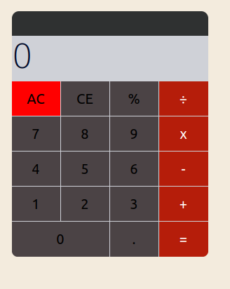

# CXFIRST JOB INTERVIEW

## Abstract

This test is a working base for an open discussion on the technical choices you will make.

You will need between 4 to 6 hours. The goal isn't to complete all the tasks and you are free to stop when you feel you have spent the appropriate amount of time. However, you shouldn't exceed 6 hours because after all it's just a job interview.

You are free to ask any question by email or Teams if the interview was on Teams.

## Description

The base project is a simple calculator written in `ReactJs` that we want to pimp with scientific calculation done by third party services. The calculation operations should also be logged and replayable.

### Front

The current calculator look like that :



The goal is to have both a standard calculation mode (that is used for simple calculations like `+,-,*,/`  and with the usual number `0,1,...9`) and a scientific like mode for more complex calculations based on third party providers.

For that part you must stick to `ReactJs`.

Here you could proceed by steps : implement first the functions `sin`, `cos`, `tan`, `exp`, `log` and the constants `pi`, `e`. 
You are free to choose any of the following providers to integrate the needed functions : `Google calculator` (*https://www.google.com/search?q=google+calculator*), `MathWay` (*https://www.mathway.com/Calculus*), `calculator-online` (*https://calculator-online.net/fr/*), `WolfRam Alpha` (*https://www.wolframalpha.com/*), `Mathdf` (*https://mathdf.com/int/*), `Dcode` (*https://www.dcode.fr/calculatrice-formelle*).

Then you can implement the computation of integrals. 

$\int_a^b f(x, y, z, ...),\mathrm{d}x$

Integrals have 4 parameters: the lower bound `a`, the upper bound `b`, the function `f` and the function parameter we want to integrate `x` (that one is by default `x` and as an optional work if you have time you could let the user choose the variable for multivariable functions).

You can consider that the functions will be of one parameter only (for example $f: x ↦ sin(x)$ and not $f: (x,y) ↦ cos(y) + sin(x)$.

For that part, you are free to choose any of the following providers to integrate the needed functions : `Google calculator` (*https://www.google.com/search?q=google+calculator*), `MathWay` (*https://www.mathway.com/fr/Calculus*), `calculator-online` (*https://calculator-online.net/fr/integral-calculator/*), `WolfRam Alpha` (*https://www.wolframalpha.com/*), `Mathdf` (*https://mathdf.com/int/*), `Dcode` (*https://www.dcode.fr/definite-integral*).

You could choose two different third party providers for each step.

### Back

The goal is to allow a user to view and replay any calculation and result he has done. Each user should be able to identify him.herself inside the calculator. But the loss of connectivity should not affect the use of the calculator, at least for the standard calculation mode.
A user should be able to retrieve his history from any calculator on any computer from the moment he has been authenticated.

For that part you are free to choose any of the following frameworks : `Symfony`, `Laravel`, `Ruby`, `Falcon`, `Django`.

For the database : `Mysql`, `MariaDb`, `Postgres`, `MongoDB`, `ElasticSearch`, `Neo4j`.

## Installation

The project runs inside a docker with webpack for ease of use. Run the following commands : 
```bash
docker-compose build
docker-compose up
```

And go the `127.0.0.1:3035`

You can also choose to run the project outside docker with `nodejs: ^14` (the version used inside the docker is `14.19.3`), then run :
```bash
yarn install
yarn start 
```

## Once the project is done

Send us back the project with :
- the needed commands to run it on our computer
- how long you have been on
- what you would have done if you had had more time, what you are not happy with inside the code, the project, ...
